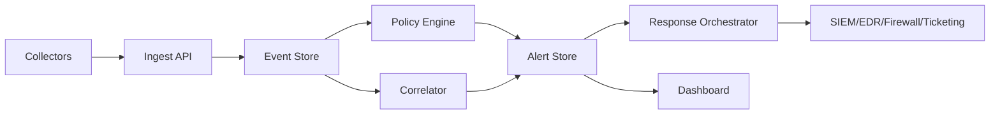

# Architecture

## Goal

Open Agentic Threat Defense detects agentic threat behavior by correlating
signals that are often handled separately:

- AI-agent and MCP-style tool calls;
- host process activity;
- outbound network flows;
- deception and canary hits;
- response and audit actions.

## MVP Components

### HTTP Service

`cmd/oadtd` starts a local HTTP service and serves both API endpoints and the
static dashboard.

### Domain Model

`internal/domain` defines the shared event, alert, asset, rule, and response
types.

### Store

`internal/store` keeps events, alerts, response actions, and risk ranked assets.
By default it runs in memory. When `--data` is set, it writes a local JSON
snapshot and restores state on startup. This keeps the MVP dependency-free while
leaving room for SQLite or Postgres in the alpha phase.

### Policy Engine

`internal/policy` evaluates single events for known defensive patterns:

- unapproved agent tool calls;
- potential secret exposure in agent context;
- unknown outbound egress;
- suspicious discovery process chains;
- canary or deception hits;
- suspicious local model runtime activity.

### Correlator

`internal/correlator` joins events over a time window and raises higher
confidence alerts when discovery, credential touch, agent tool use, and egress
appear on the same asset.

### Response Planner

`internal/response` creates dry-run response plans. The MVP does not execute
containment actions against real systems.

### Dashboard

`web/` provides an operational dashboard for assets, alerts, events, policies,
and dry-run response actions.

### Write Authentication

Write endpoints can be protected with `--api-token` or `OATD_API_TOKEN`.
Read endpoints remain available so the dashboard and health checks can load
without embedding a token in static assets.

## Near-Term Production Shape

The next architecture step is to split collectors, policy evaluation, durable
storage, and response execution:

The current file-backed snapshot should be treated as local development storage,
not as a clustered production database.

## Defensive Boundaries

The system should only simulate adversary behavior by emitting telemetry. It
must not include exploit code, self-propagation, credential theft, or destructive
actions.
