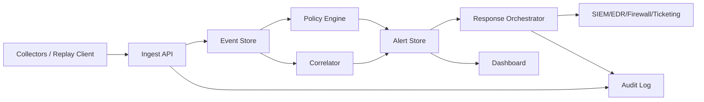

# Architecture

## Goal

Open Agentic Threat Defense detects agentic threat behavior by correlating
signals that are often handled separately:

- AI-agent and MCP-style tool calls;
- inline tool-call gate decisions before tool execution;
- host process activity;
- outbound network flows;
- deception and canary hits;
- response and audit actions.

## MVP Components

### HTTP Service

`cmd/oadtd` starts a local HTTP service and serves both API endpoints and the
static dashboard. The service also exposes `GET /healthz` and `GET /readyz`
for process and Postgres readiness checks.

### Replay and Collector Clients

`cmd/oadtdctl` provides operational helper commands. The first command,
`replay`, reads newline-delimited JSON events and sends them to the ingest API.
This gives teams a safe way to replay logs and simulation traces without adding
offensive behavior.

The `collect` command normalizes supported defensive telemetry sources into
OATD JSONL. Current sources are Sysmon JSON, auditd text, Zeek conn logs, and
Suricata EVE JSON.

The `agent` command is a long-running collector that tails a source file,
persists its offset state, normalizes newly appended content, and posts event
batches to the ingest API. It is intended for lab and lightweight deployment
scenarios where a direct file tail is enough.

Native modes for Windows Event Log and Linux journald are supported for direct
platform collection without relying on a log file tail.

### Domain Model

`internal/domain` defines the shared event, alert, asset, rule, response, and
audit event types.

### Store

`internal/store` keeps events, alerts, response actions, audit events, and risk
ranked assets. For production, `--postgres-dsn` stores data in Postgres tables
with JSONB payloads and indexed core columns. Schema changes are applied through
versioned migrations recorded in `oatd_schema_migrations`. For local
development, `--data` writes a JSON snapshot and restores state on startup.
`oadtdctl backup` and `oadtdctl restore` reuse the same snapshot shape for
portable Postgres backups.

### Policy Engine

`internal/policy` evaluates single events for known defensive patterns:

- unapproved agent tool calls;
- potential secret exposure in agent context;
- unknown outbound egress;
- suspicious discovery process chains;
- canary or deception hits;
- suspicious local model runtime activity.

Approved agent tools and egress hosts are configurable through `--policy`.
If no policy file is supplied, the built-in defaults are used.
The policy engine is packaged as a versioned threat pack so rule content and
allowlists can evolve together.

### Inline Gateway

The Wedge is an inline tool-call policy enforcement point that sits in front
of agent execution. `POST /api/gateway/execute` evaluates a proposed tool call
and enforces one of three outcomes before the tool can run:

- `executed`
- `blocked`
- `pending_approval`

`POST /api/gateway/decide` remains the diagnostic PDP endpoint. The execution
path reuses the same policy engine, alert store, audit log, and response
planner as the rest of the service, but it now actually gates and executes the
allowed stub tool. That gives the product a control-point shape that is
distinct from a pure SOC/XDR telemetry platform.

Decision intelligence is taint-aware: the gate carries source, sink, flow, and
provenance metadata forward so tool calls can be explained as source-to-sink
paths rather than only as keyword hits.

Require-approval and deny outcomes create a persisted gateway action record so
the decision path is visible in the same approval queue and audit trail as the
rest of the response workflow. The `oadtdctl wedge-demo` command exercises the
full sequence end to end. `GET /api/gateway/queue` lists pending gateway
actions and `GET /api/gateway/actions/{id}` exposes the live approval state for
polling or console workflows.

`POST /api/gateway/proxy` adds a transport proxy path for tool backends. It
evaluates the proposed call inline, then forwards the payload to a configured
upstream only when the policy verdict allows it.

The gateway path is bounded by a configurable in-flight limit so the critical
decision path can apply backpressure instead of accepting unbounded load.

### Correlator

`internal/correlator` joins events over a time window and raises higher
confidence alerts when discovery, credential touch, agent tool use, and egress
appear on the same asset. The window is configurable with
`correlation_window` in the policy file.

### Response Planner

`internal/response` creates dry-run response plans. The MVP does not execute
containment actions against real systems.

Response actions that would affect hosts, egress, tools, or secrets are marked
as requiring approval before any execution backend can act on them. Approved
actions can be exported to an external webhook transport, which keeps the
execution gate outside the core service.

Planned incident-ticket actions are exported immediately to a separate ticket
connector so operators get a traceable incident record even when a containment
step still needs approval.

For concrete target systems, GitHub issue creation can stand in for incident
tracking, and GitHub Actions workflow dispatch can act as the approval-gated
runbook executor.

### Dashboard

`web/` provides an operational dashboard for assets, alerts, events, policies,
and dry-run response actions. The browser uses `POST /api/session` to create a
session cookie and `GET /api/session` to restore its authenticated state on
reload.

### Authentication And RBAC

API access supports user tokens with RBAC roles configured in the policy file.
Token values are not stored in config; only SHA-256 token hashes are stored.
The legacy `--api-token` path behaves as an admin token for compatibility.

### Audit Logging

The HTTP layer records audit events for authentication failures, RBAC denials,
event ingestion, demo loads, response planning, and response approvals. Audit
events are first-class store records and are persisted to Postgres table
`oatd_audit_events` in production mode. Each audit record is chained to the
previous one with a SHA-256 hash so tampering becomes visible on readback.
`GET /api/audit/chain` exposes the current chain state.

### SIEM/Webhook Export

When `--alert-webhook-url` is set, newly created alerts are sent to that
endpoint as `oadtd.alerts` JSON payloads.

When `--ticket-webhook-url` is set, planned incident-ticket actions are sent as
`oadtd.incident_ticket` payloads.

When `--response-webhook-url` is set, approved response actions are exported as
`oadtd.response_action` payloads after approval.

## Near-Term Production Shape

The next architecture step is to split collectors, policy evaluation, durable
storage, and response execution:

The current file-backed snapshot should be treated as local development storage,
not as the production database. Production deployments should use Postgres.

## Defensive Boundaries

The system should only simulate adversary behavior by emitting telemetry. It
must not include exploit code, self-propagation, credential theft, or destructive
actions.
